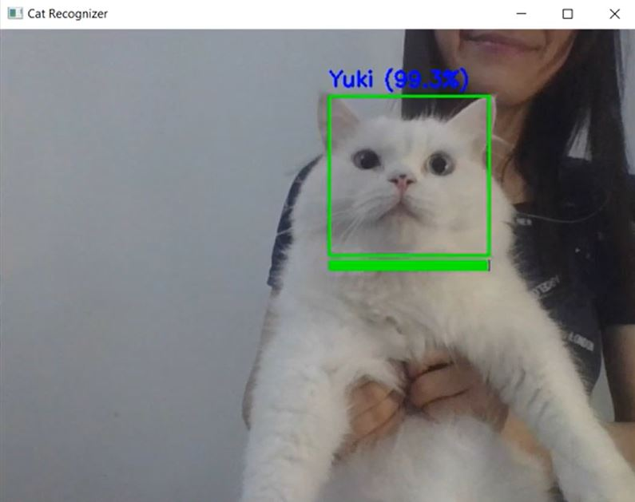
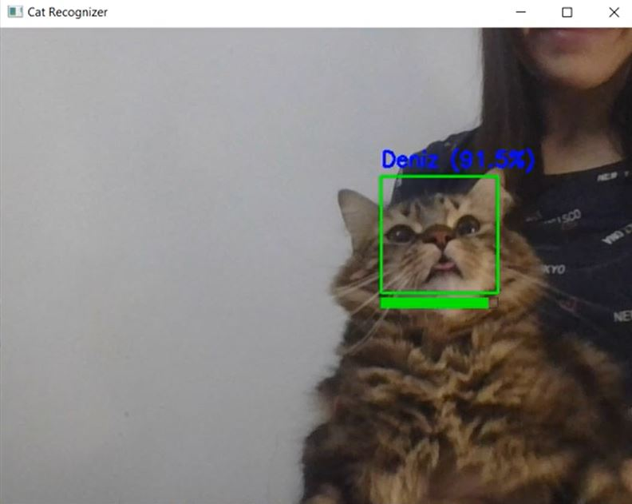
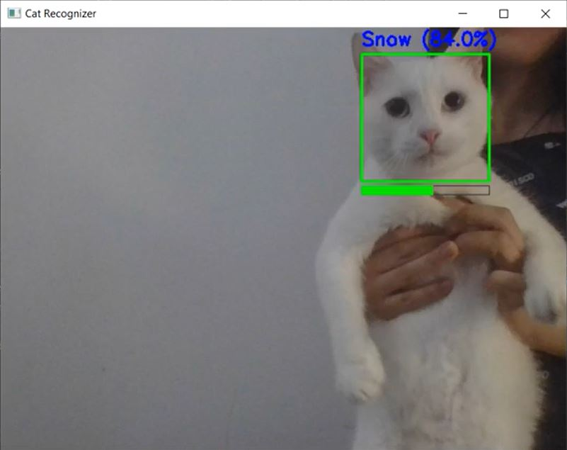
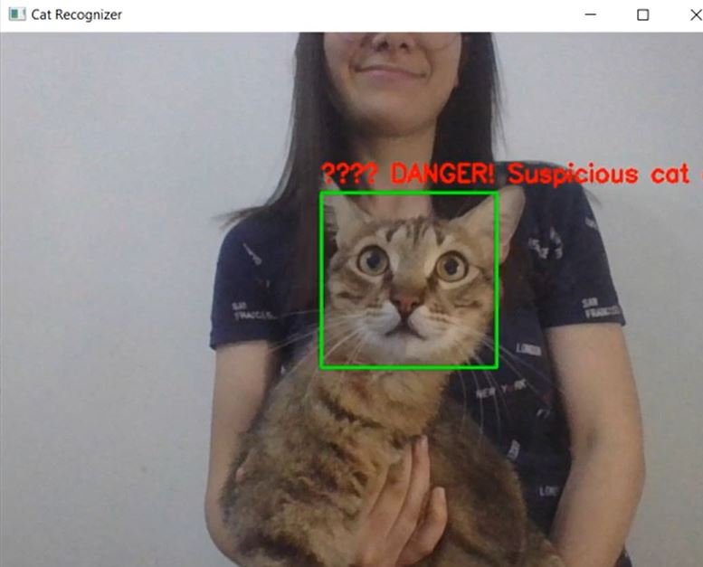
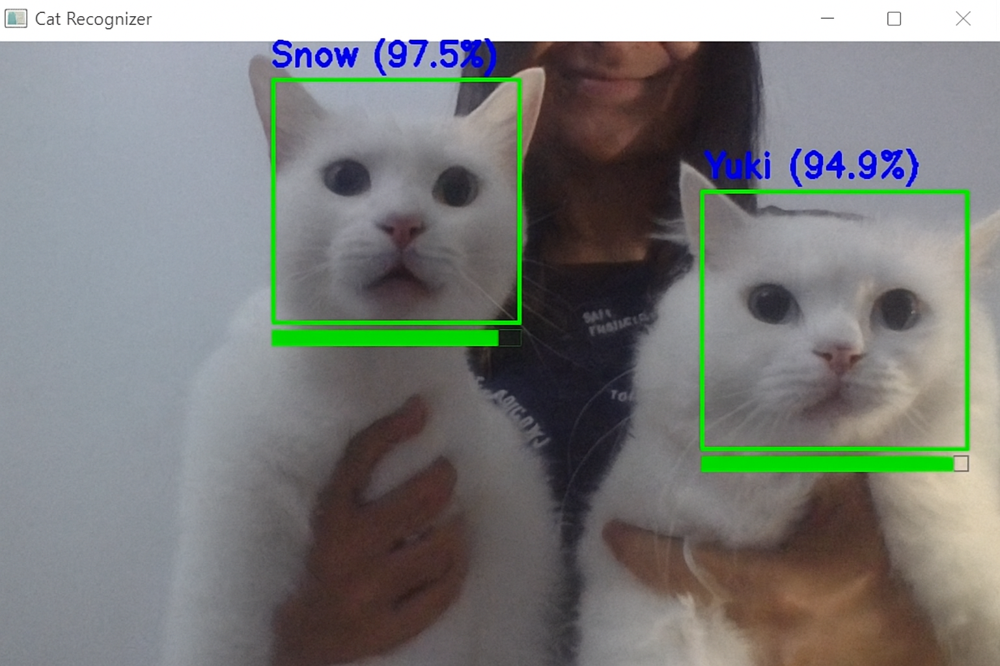
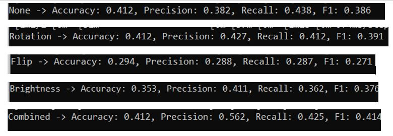
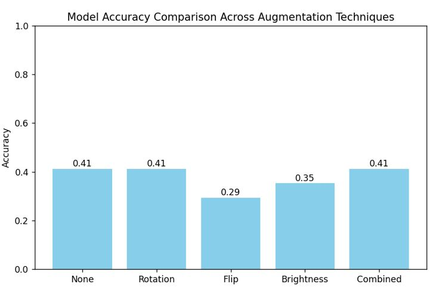

# 🐱 Meow-ster Detective – Real-time Cat Face Recognition

A real-time cat face recognition app using **TensorFlow**, **OpenCV**, and **Streamlit**, trained on a small custom dataset of my cats’ photos. The project demonstrates computer vision, real-time ML deployment, and data augmentation strategies.

---

## Features

- Detects cat faces in real-time using OpenCV Haar cascades.  
- Classifies known cats with confidence scores and top-3 predictions.  
- Triggers a **“🚨 DANGER! Suspicious cat detected!”** alert for unknown cats.  
- Smooth predictions to avoid flickering.  
- Supports experimentation with different **data augmentation techniques**.  

---


###DEMO

## 🐱 Real-time Cat Recognition – Screenshots

Here are some screenshots of the cat recognition app in action:

**Webcam Detection Example:**  





➡️ Even though the two cats look very similar (same fur color, same eye color), the model successfully distinguishes between them.

😺 Note: The fourth known cat, Caramel, isn’t shown in the demo because he was sleeping during recording.

## 📊 Data Augmentation Comparison

Here are visual comparisons of different data augmentation techniques applied during training:

**Augmentation Comparison Table:**  


**Accuracy & Precision Plot:**  


## Project Structure

Meow-ster Detective/  
│  
├─ train.py           # Full training script: trains the CNN model with optional data augmentation and fine-tuning  
├─ main.py            # Real-time webcam app using the trained model for cat recognition  
├─ app.py             # Streamlit deployment of the cat recognition app (optional GUI interface)  
├─ compare_train.py   # Compares different data augmentation strategies  
├─ dataset/           # Folder containing images of cats (organized in subfolders by class)  
├─ models/            # Saved models (created after training)  
├─ class_names.txt    # Text file storing class names (created after training)  
└─ README.md          # This file (documentation)  

---


### Setup

```bash
# 1.1 Create virtual environment (optional but recommanded)
python -m venv meow

# 1.2 Activate on Windows
meow\Scripts\activate

# 1.2 Activate on Linux/macOS
source meow/bin/activate
--- 

## 2. Install Dependencies
pip install tensorflow opencv-python numpy streamlit scipy matplotlib scikit-learn

## 3. Train the Model
python train.py

## 4. Run Real-time Recognition App 
python main.py

#OR#

#Streamlit GUI version:
streamlit run app.py

-->Press q to quit the OpenCV webcam app

## 5. Compare Data Augmentation Techniques
python compare_train.py


